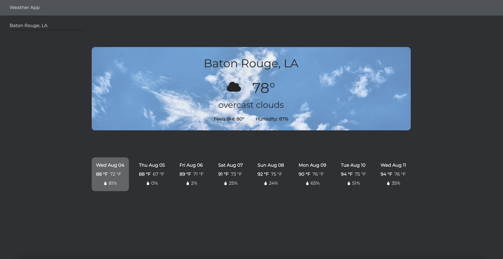

# Weather App

> A web application that allows you to the check the weather in any city in the world.

## Technologies Used

-   React - version 3.5.1
-   Chakra UI - version 1.6.0
-   OpenWeather API

## Screenshots



## Setup

To run this project, install it locally using yarn or npm

yarn

```
$ cd ../weather-app
$ yarn
$ yarn start
```

npm

```
$ cd ../weather-app
$ npm install
$ npm start
```

## Usage

-   Type in the location in which you wish to check the weather using the format: City, State Abbreviation
-   For cities outside of the US use the format: City,

## Features

-   Get current weather of desired city
-   See the forcast for the next 7 days

## Contact

Created by [Dani Tyler](https://www.dani-tyler.com)
